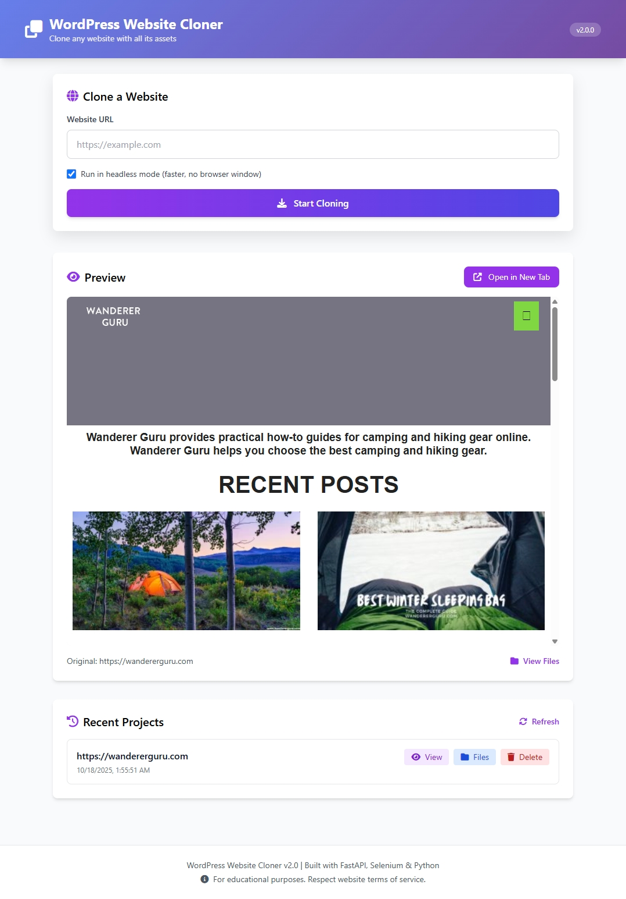

# WordPress Website Cloner v2.0

A modern, professional-grade website cloner built with Python, Selenium 4.x, and Beautiful Soup. Clone any website locally with all its assets including HTML, CSS, JavaScript, images, and fonts.

## 📸 Screenshots


*Beautiful Web UI with live preview of cloned websites*

## ✨ Features

- **🚀 Modern Stack**: Built with latest Selenium 4.x, Python 3.10+ type hints, and modern async patterns
- **🤖 Auto ChromeDriver**: Automatically downloads and manages ChromeDriver - no manual setup needed!
- **📦 Complete Asset Download**: Downloads HTML, CSS, JS, images, fonts, and all referenced resources
- **🎨 CSS Asset Extraction**: Intelligently extracts and downloads assets from `url()` declarations in CSS
- **🔍 Network Monitoring**: Uses browser DevTools to capture dynamically loaded resources
- **🌐 Flask API**: RESTful API for programmatic website cloning
- **📝 Professional Logging**: Beautiful, structured logging with Loguru
- **⚙️ Configurable**: Environment-based configuration with sensible defaults
- **🏗️ Clean Architecture**: Modular, testable code with separation of concerns

## 📋 Requirements

- Python 3.10+
- Google Chrome browser (latest stable version)

## 🚀 Quick Start

### Installation

```bash
# Clone the repository
git clone <repository-url>
cd Wordpress-Detailed-Clone-Selenium-Python-Requests

# Create virtual environment (recommended)
python -m venv venv
source venv/bin/activate  # On Windows: venv\Scripts\activate

# Install dependencies
pip install -r requirements.txt
```

### 🌐 Web UI (Recommended for Beginners)

The easiest way to use the cloner is through the beautiful web interface:

```bash
# Start the Web UI
python run_webui.py

# Then open in browser: http://localhost:8000
```

**Features:**
- 🎨 Beautiful, modern interface
- 👁️ Live preview in iframe
- 📚 Project history management
- ⚡ Real-time progress tracking

See [WEB_UI_GUIDE.md](WEB_UI_GUIDE.md) for detailed Web UI documentation.

### Basic Usage

**Command Line:**

```bash
# Clone a website
python -m src.main https://example.com

# Run with visible browser (not headless)
python -m src.main https://example.com --visible

# Custom output directory
python -m src.main https://example.com --output ./my-clones

# Enable debug logging
python -m src.main https://example.com --debug
```

**As Python Module:**

```python
from src.cloner import clone_website

# Clone a website
output_path = clone_website("https://example.com")
print(f"Website cloned to: {output_path}")

# With custom settings
output_path = clone_website(
    "https://example.com",
    headless=False  # Show browser
)
```

**Flask API:**

```bash
# Start the API server
python -m src.app

# Or use the convenience function
python -c "from src.app import run_server; run_server()"
```

API Endpoints:
- `GET /` - API information
- `GET /health` - Health check
- `GET /clone?url=<url>` - Clone website from URL
- `POST /clone` - Clone website (JSON body: `{"url": "https://example.com"}`)
- `GET /clone/<base64_url>` - Clone from base64-encoded URL

Example API usage:
```bash
# Clone via query parameter
curl "http://localhost:5000/clone?url=https://example.com"

# Clone via POST
curl -X POST http://localhost:5000/clone \
  -H "Content-Type: application/json" \
  -d '{"url": "https://example.com"}'
```

## 📁 Project Structure

```
src/
├── __init__.py              # Package initialization
├── config.py                # Configuration management
├── cloner.py                # Main cloner class
├── main.py                  # CLI entry point
├── app.py                   # Flask API application
├── drivers/
│   ├── __init__.py
│   └── chrome_driver.py     # Modern Selenium 4.x ChromeDriver manager
├── downloaders/
│   ├── __init__.py
│   ├── resource_downloader.py  # Resource downloading with retry logic
│   └── css_downloader.py       # CSS asset extraction
├── parsers/
│   ├── __init__.py
│   └── html_parser.py          # HTML parsing and asset extraction
└── utils/
    ├── __init__.py
    ├── logger.py               # Logging configuration
    ├── url_utils.py            # URL manipulation utilities
    └── file_utils.py           # File management utilities
```

## ⚙️ Configuration

Create a `.env` file in the project root (copy from `.env.example`):

```env
# Browser Settings
HEADLESS=true
BROWSER_TIMEOUT=30
PAGE_LOAD_WAIT=5

# Download Settings
REQUEST_TIMEOUT=7

# Flask Settings
FLASK_HOST=localhost
FLASK_PORT=5000
FLASK_DEBUG=false
```

## 🎯 What's New in v2.0

### Major Improvements

1. **🔄 Automatic ChromeDriver Management**
   - Uses `webdriver-manager` to auto-download compatible ChromeDriver
   - No more manual driver downloads or version mismatches!

2. **🏗️ Modern Architecture**
   - Clean separation of concerns
   - Object-oriented design with dependency injection
   - Type hints throughout for better IDE support

3. **📊 Professional Logging**
   - Beautiful colored console output with Loguru
   - File logging with rotation and compression
   - Structured logging for better debugging

4. **🔧 Configuration Management**
   - Environment-based configuration
   - Sensible defaults with easy customization
   - No hardcoded values

5. **🌐 Modern Selenium 4.x**
   - Updated to latest Selenium syntax
   - Uses `Service` and `Options` classes
   - Chrome DevTools Protocol integration

6. **🐛 Bug Fixes**
   - Fixed deprecated `chrome_options` parameter
   - Fixed `DesiredCapabilities` deprecation
   - Better error handling and retry logic
   - Fixed CSS asset extraction issues

7. **📦 Better Dependency Management**
   - Pinned versions for reproducibility
   - Removed unnecessary dependencies
   - Modern package versions

### Breaking Changes

- Old entry points (`AppMain.py`, `Main.py`) are now deprecated
- Use `python -m src.main` instead
- Flask app moved to `src/app.py`

## 🔍 How It Works

1. **Page Loading**: Selenium loads the webpage and waits for dynamic content
2. **Network Capture**: Browser DevTools captures all network requests
3. **HTML Parsing**: BeautifulSoup extracts all asset references (``, `<link>`, `<script>`, etc.)
4. **Asset Download**: Downloads all assets with retry logic and fallback mechanisms
5. **CSS Processing**: Extracts and downloads assets from CSS `url()` declarations
6. **Path Rewriting**: Updates all URLs to point to local files
7. **Project Structure**: Maintains original directory structure for assets

## 🐛 Troubleshooting

**ChromeDriver Issues:**
- The app now auto-downloads ChromeDriver - no manual setup needed!
- If you encounter issues, try: `pip install --upgrade webdriver-manager`

**Missing Assets:**
- Check the logs with `--debug` flag
- Some assets may be blocked by CORS or authentication
- Network logs help identify dynamically loaded resources

**Performance:**
- Adjust `PAGE_LOAD_WAIT` in config for slower websites
- Use headless mode for better performance

## 📝 Development

### Running Tests

```bash
# Install dev dependencies
pip install pytest pytest-cov

# Run tests (when implemented)
pytest
```

### Code Style

```bash
# Format code
pip install black isort
black src/
isort src/
```

## 🤝 Contributing

Contributions are welcome! Please:
1. Fork the repository
2. Create a feature branch
3. Make your changes
4. Add tests if applicable
5. Submit a pull request

## 📄 License

[Your License Here]

## 🙏 Acknowledgments

- Built with Selenium, BeautifulSoup, Flask, and Loguru
- Uses webdriver-manager for automatic ChromeDriver management

## 📧 Support

For issues and questions, please open a GitHub issue.

---

**Note**: This tool is for educational purposes and testing. Always respect website terms of service and robots.txt when cloning websites.
