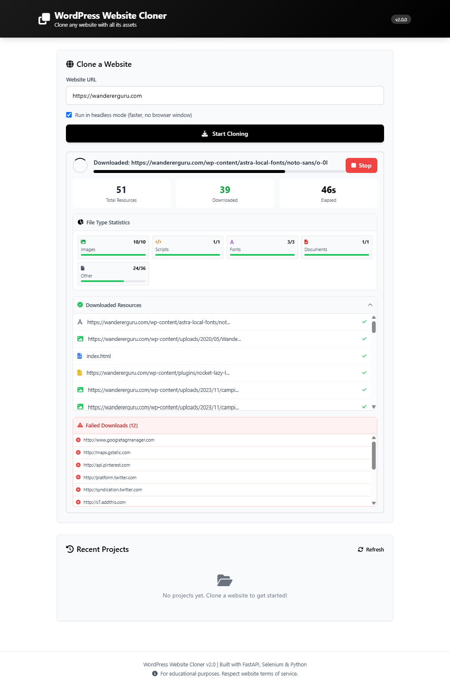

# Website Cloner v2.0

> **A professional Python library for cloning websites with all assets (HTML, CSS, JavaScript, images, fonts) - complete with a beautiful Web UI demo**

[](https://www.python.org/downloads/)
[](LICENSE)

---

## 🎯 Two Ways to Use This Project

This project serves **two distinct purposes**:

### 1. 🌐 **Web UI Application** (Demonstration & Testing)
A beautiful, user-friendly web interface for cloning websites - perfect for:
- Testing the cloning functionality
- One-off website backups
- Non-technical users who need a visual interface
- Demonstrating capabilities to clients

👉 **Start the Web UI**: `python run_webui.py` → Open http://localhost:8000

---

### 2. 🐍 **Python Library/SDK** (Embed in Your Applications)
A powerful Python library you can integrate into your own applications - perfect for:
- Building SaaS products (website backup services)
- Automating website archival workflows
- Creating monitoring/comparison tools
- Embedding cloning functionality in existing projects

👉 **Use as Library**:
```python
from src import ClonerSDK

cloner = ClonerSDK()

@cloner.on_progress
def track_progress(data):
    print(f"{data.percentage}% - {data.message}")

output = cloner.clone("https://example.com")
```

---

## 📸 Screenshots


*Beautiful Web UI with real-time progress tracking and file type analytics*

---

## ✨ Features

### Core Functionality
- ✅ **JavaScript Execution**: Handles modern SPAs (React, Vue, Angular) using Selenium
- ✅ **Complete Asset Download**: HTML, CSS, JavaScript, images, fonts, and all resources
- ✅ **Network Monitoring**: Captures dynamically-loaded assets via Chrome DevTools
- ✅ **Smart CSS Processing**: Extracts and downloads assets from `url()` declarations
- ✅ **Auto ChromeDriver**: Automatically downloads and manages ChromeDriver - zero manual setup

### For Library Users (Developers)
- 🐍 **Event-Driven SDK**: Subscribe to 14+ events for real-time updates
- 📊 **File Type Analytics**: Track downloads by category (images, CSS, JS, fonts, etc.)
- 🎯 **Decorator API**: Clean, Pythonic event handling with decorators
- 📦 **Pip Installable**: One-command installation
- 🔄 **Progress Callbacks**: Real-time percentage, stage, and message updates
- 💾 **Download Statistics**: Success/failure tracking per file type

### For Web UI Users
- 🎨 **Beautiful Interface**: Modern, clean design with real-time updates
- 👁️ **Live Preview**: View cloned websites in iframe
- 📚 **Project History**: Manage multiple cloned projects
- 📊 **Visual Analytics**: File type breakdown with progress bars
- ⚠️ **Failed Downloads**: Clear list of files that couldn't be downloaded
- ⏱️ **Real-Time Progress**: Watch cloning happen live

---

## 📋 Requirements

- **Python 3.10+**
- **Google Chrome** (latest stable version)
- **Internet connection** (for initial ChromeDriver download)

---

## 🚀 Quick Start

### Installation

```bash
# Clone the repository
git clone <repository-url>
cd Wordpress-Detailed-Clone-Selenium-Python-Requests

# Create virtual environment (recommended)
python -m venv venv
source venv/bin/activate  # Windows: venv\Scripts\activate

# Install dependencies
pip install -r requirements.txt
```

---

## 🌐 Option 1: Web UI (Demo Application)

The easiest way to test the cloner is through the web interface:

```bash
# Start the Web UI
python run_webui.py

# Open in browser
http://localhost:8000
```

**Web UI Features:**
- Clone websites by entering URL
- Real-time progress tracking with percentage
- File type breakdown (images, CSS, JS, fonts, etc.)
- Failed downloads list
- Live preview of cloned site
- Project history management

**Perfect for:**
- Quick website backups
- Testing cloning functionality
- Demonstrating to non-technical users
- One-off archival tasks

---

## 🐍 Option 2: Python Library (For Developers)

Embed the cloner in your own applications with full programmatic control.

### Simple Example

```python
from src import clone_website

# Clone a website (one line!)
output_path = clone_website("https://example.com")
print(f"Cloned to: {output_path}")
```

### With Progress Tracking

```python
from src import ClonerSDK

cloner = ClonerSDK(headless=True)

@cloner.on_progress
def handle_progress(data):
    print(f"[{data.percentage:5.1f}%] {data.message}")

@cloner.on_complete
def handle_complete(data):
    print(f"✅ Success! Downloaded {data.successful_downloads} files in {data.duration_seconds:.2f}s")

@cloner.on_resource_downloaded
def handle_download(data):
    print(f"  ✓ {data.url}")

output_path = cloner.clone("https://example.com")
```

### Event-Driven Architecture

The SDK emits **14+ events** covering the entire cloning lifecycle:

**Lifecycle Events:**
- `CLONE_START` - Cloning begins
- `CLONE_COMPLETE` - Cloning finished successfully
- `CLONE_ERROR` - Error occurred

**Progress Events:**
- `PROGRESS_UPDATE` - General progress (percentage, stage, message)
- `PAGE_LOADED` - Page loaded in browser
- `NETWORK_LOGS_EXTRACTED` - Network requests captured
- `HTML_PROCESSING_START` / `COMPLETE` - HTML processing stage
- `CSS_PROCESSING_START` / `COMPLETE` - CSS processing stage

**Download Events:**
- `RESOURCE_DISCOVERED` - New resource found
- `RESOURCE_DOWNLOAD_SUCCESS` - Resource downloaded
- `RESOURCE_DOWNLOAD_FAILED` - Download failed
- `STATS_UPDATE` - Statistics updated

### Real-World Integration Example

```python
from src import ClonerSDK
import requests  # For webhooks
import sqlite3  # For database

# Your application code
cloner = ClonerSDK()

@cloner.on_complete
def notify_and_save(data):
    # Send webhook notification
    requests.post("https://yourapp.com/webhook", json={
        "event": "clone_complete",
        "url": data.url,
        "duration": data.duration_seconds,
        "downloads": data.successful_downloads
    })

    # Save to database
    db = sqlite3.connect("clones.db")
    db.execute(
        "INSERT INTO clones (url, output_path, duration) VALUES (?, ?, ?)",
        (data.url, data.output_path, data.duration_seconds)
    )
    db.commit()

# Clone as part of your workflow
cloner.clone("https://example.com")
```

**Perfect for:**
- Building SaaS products
- Automating backups
- CI/CD pipelines
- Monitoring systems
- Custom workflows

---

## 📚 Library Documentation

### Basic Usage

```python
from src import clone_website

# Simple one-liner
output = clone_website("https://example.com")
```

### SDK Class

```python
from src import ClonerSDK, ClonerEvents

cloner = ClonerSDK(headless=True)

# Subscribe to events
@cloner.on_start
def on_start(data):
    print(f"Starting: {data.url}")

@cloner.on_progress
def on_progress(data):
    print(f"{data.percentage}% - {data.stage}")

@cloner.on_complete
def on_complete(data):
    print(f"Done! Output: {data.output_path}")
    print(f"Stats: {data.successful_downloads}/{data.total_resources}")

# Clone website
output = cloner.clone("https://example.com")
```

### Available Events

| Event | Data Class | Description |
|-------|------------|-------------|
| `CLONE_START` | `CloneStartData` | url, headless |
| `CLONE_COMPLETE` | `CloneCompleteData` | url, output_path, duration_seconds, stats |
| `CLONE_ERROR` | `CloneErrorData` | url, error, traceback |
| `PROGRESS_UPDATE` | `ProgressData` | stage, message, percentage |
| `RESOURCE_DOWNLOAD_SUCCESS` | `ResourceData` | url, file_path, file_type |
| `RESOURCE_DOWNLOAD_FAILED` | `ResourceData` | url, error |
| `STATS_UPDATE` | `StatsData` | total, success, failed, skipped |

### Configuration

```python
# Via environment variables (.env file)
HEADLESS=true
BROWSER_TIMEOUT=30
PAGE_LOAD_WAIT=5
REQUEST_TIMEOUT=7
MAX_WORKERS=10  # Parallel downloads

# Via code
from src.config import config
config.HEADLESS = False  # Show browser
config.MAX_WORKERS = 20  # More parallel downloads
```

---

## 📊 File Type Analytics

The cloner tracks downloads across **8 categories** with **40+ file extensions**:

- **Images**: jpg, jpeg, png, gif, webp, svg, ico, bmp, tiff, avif
- **Stylesheets**: css, scss, sass, less
- **Scripts**: js, jsx, ts, tsx, mjs, cjs
- **Fonts**: woff, woff2, ttf, otf, eot
- **Documents**: html, php, xml, txt, md, pdf
- **Media**: mp4, webm, ogg, mp3, wav, etc.
- **Data**: json, yaml, csv
- **Other**: Everything else

Each category shows:
- Total files found
- Successfully downloaded
- Failed downloads
- Visual progress bar

---

## 📁 Project Structure

```
src/
├── __init__.py              # Library exports (ClonerSDK, clone_website, etc.)
├── config.py                # Configuration management
├── cloner.py                # Main WebsiteCloner class
├── sdk.py                   # Developer-friendly SDK wrapper
├── main.py                  # CLI entry point
├── events/
│   ├── __init__.py
│   └── event_emitter.py     # Event system
├── drivers/
│   ├── __init__.py
│   └── chrome_driver.py     # Selenium ChromeDriver manager
├── downloaders/
│   ├── __init__.py
│   ├── resource_downloader.py  # Resource downloading
│   └── css_downloader.py       # CSS asset extraction
├── parsers/
│   ├── __init__.py
│   └── html_parser.py          # HTML parsing
├── utils/
│   ├── __init__.py
│   ├── logger.py               # Logging
│   ├── url_utils.py            # URL utilities
│   └── file_utils.py           # File management
└── web/
    ├── fastapi_app.py          # Web UI backend
    └── templates/
        └── index.html          # Web UI frontend

examples/                    # Library usage examples
├── basic_usage.py
├── advanced_usage.py
├── batch_cloning.py
└── custom_integration.py

run_webui.py                # Start Web UI
setup.py                    # Pip installation
pyproject.toml              # Modern Python packaging
```

---

## 🔧 Command Line Interface

```bash
# Clone a website
python -m src.main https://example.com

# Custom output directory
python -m src.main https://example.com --output ./my-clones

# Show browser (not headless)
python -m src.main https://example.com --visible

# Enable debug logging
python -m src.main https://example.com --debug
```

---

## 🎯 Use Cases

### 1. **SaaS Product**
Build a website backup service:
```python
# Your FastAPI/Flask app
@app.post("/api/clone")
async def clone_website_api(url: str):
    cloner = ClonerSDK()

    @cloner.on_progress
    async def send_progress(data):
        await websocket.send_json({"progress": data.percentage})

    output = await asyncio.to_thread(cloner.clone, url)
    return {"output": str(output)}
```

### 2. **Automated Backups**
Schedule daily backups:
```python
# cron job script
from src import clone_website

sites = ["https://mybusiness.com", "https://blog.company.com"]

for site in sites:
    output = clone_website(site)
    print(f"Backed up {site} to {output}")
```

### 3. **CI/CD Integration**
Test website migrations:
```python
# In your tests
def test_website_migration():
    # Clone production site
    prod = clone_website("https://prod.example.com")

    # Clone staging site
    staging = clone_website("https://staging.example.com")

    # Compare outputs
    assert prod.exists()
    assert staging.exists()
```

### 4. **Compliance/Legal**
Automated archival for regulatory compliance:
```python
from src import ClonerSDK
import datetime

cloner = ClonerSDK()

@cloner.on_complete
def save_audit_trail(data):
    with open("audit_log.txt", "a") as f:
        f.write(f"{datetime.datetime.now()}: Archived {data.url}\n")

cloner.clone("https://company-website.com")
```

---

## ⚙️ Configuration

Create a `.env` file in the project root:

```env
# Browser Settings
HEADLESS=true
BROWSER_TIMEOUT=30
PAGE_LOAD_WAIT=5

# Download Settings
REQUEST_TIMEOUT=7
MAX_WORKERS=10

# Web UI Settings
FLASK_HOST=localhost
FLASK_PORT=8000
FLASK_DEBUG=false
```

---

## 🐛 Troubleshooting

**ChromeDriver Issues:**
- Auto-downloads ChromeDriver - no manual setup needed
- If issues occur: `pip install --upgrade webdriver-manager`

**Missing Assets:**
- Check logs with `--debug` flag
- Some assets may be blocked by CORS
- Use network logs to identify issues

**Performance:**
- Increase `MAX_WORKERS` for faster downloads
- Adjust `PAGE_LOAD_WAIT` for slower sites
- Use `headless=True` for better performance

---

## 📖 Examples

See the `examples/` directory for complete examples:

- **`basic_usage.py`**: Simple cloning with callbacks
- **`advanced_usage.py`**: Full event handling with decorators
- **`batch_cloning.py`**: Clone multiple sites with reporting
- **`custom_integration.py`**: Database, webhook, and monitoring integration

---

## 🤝 Contributing

Contributions welcome! Please:
1. Fork the repository
2. Create a feature branch
3. Make your changes
4. Add tests if applicable
5. Submit a pull request

---

## 📄 License

MIT License - See LICENSE file for details

---

## 🙏 Acknowledgments

Built with:
- **Selenium 4.x** - Browser automation
- **BeautifulSoup** - HTML parsing
- **FastAPI** - Web UI backend
- **Loguru** - Professional logging
- **webdriver-manager** - Auto ChromeDriver management

---

## 📧 Support

For issues and questions:
- GitHub Issues: [Create an issue](../../issues)
- Documentation: This README

---

## ⚠️ Important Notes

**Legal Notice:**
- This tool is for educational purposes and testing
- Always respect website terms of service
- Check `robots.txt` before cloning
- Do not use for unauthorized scraping
- Respect copyright and intellectual property

**Best Practices:**
- Use reasonable request rates
- Don't overload servers
- Clone only what you need
- Test with small sites first

---

**Built with ❤️ for developers who need to clone websites**

---

## 🆚 Why Choose This Over Alternatives?

| Feature | This Project | HTTrack | Wget | Scrapy |
|---------|--------------|---------|------|--------|
| JavaScript Execution | ✅ | ❌ | ❌ | ❌ |
| Python SDK | ✅ | ❌ | ❌ | ✅ (complex) |
| Web UI | ✅ | ❌ | ❌ | ❌ |
| Event System | ✅ | ❌ | ❌ | ❌ |
| Auto ChromeDriver | ✅ | N/A | N/A | ❌ |
| File Type Analytics | ✅ | ❌ | ❌ | ❌ |
| Modern Tech Stack | ✅ | ❌ (outdated) | ❌ | ✅ |
| Beginner Friendly | ✅ | ⚠️ | ❌ | ❌ |
| Developer Friendly | ✅ | ❌ | ⚠️ | ✅ |

**Perfect for:**
- Developers building SaaS products
- Agencies needing automated backups
- Compliance teams requiring archival
- Anyone needing to clone modern websites

---

**Remember:** Use the **Web UI** for quick testing, use the **Library** for building applications! 🚀
